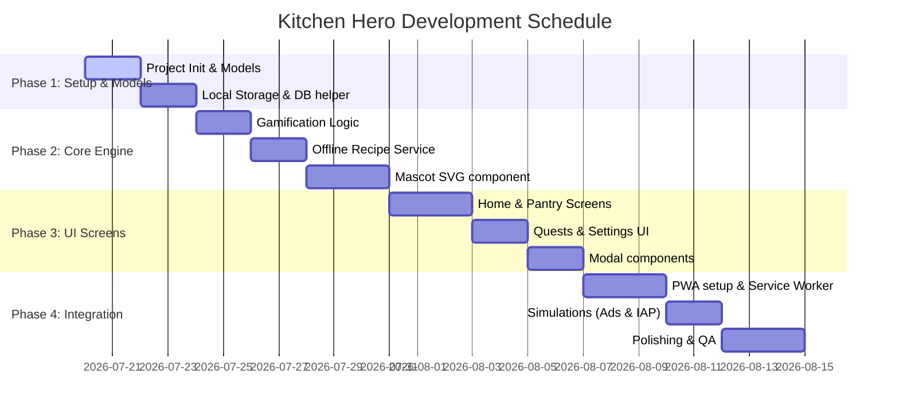

# Workflow & Implementation Plan

## Kitchen Hero (Pantry RPG)
**Version:** 1.0  
**Status:** Active  

---

## 1. Development Roadmap (React PWA Timeline)

---

## 2. Iteration Workflow (Continuous Verification)
1. **Model Validation:** Compile-time check on types.
2. **Business Logic Unit Tests:** Validate level-up carry-over and streak incrementation in mock environments.
3. **Mascot Render Tests:** Verify SVG layers, eyes, and mouth layouts across states.
4. **UI Responsiveness:** Test layouts on mobile aspect ratios (360x740, 390x844, 412x915).
5. **PWA Offline Testing:** Disable network connection in DevTools, log presets, verify write state persists.
6. **Production Bundling:** Compile via `tsc -b && vite build` to check artifact sizes.

---

## 3. Milestones & Gates

| Milestone | Deliverables | Verification Gate |
|-----------|--------------|-------------------|
| **M1: Data Layer** | `types/index.ts`, `services/db.ts` | Sub-1ms writes, data loads successfully on page refresh. |
| **M2: Mascot SVG** | `Mascot.tsx`, `Mascot.css` | All 5 animation states display without clipping. |
| **M3: Main View** | Tabs implementation (`App.tsx`) | Tab-switching state transitions without resetting state. |
| **M4: PWA Release** | `manifest.webmanifest` & build | Service worker caches pages; installable from Chrome/Safari. |
